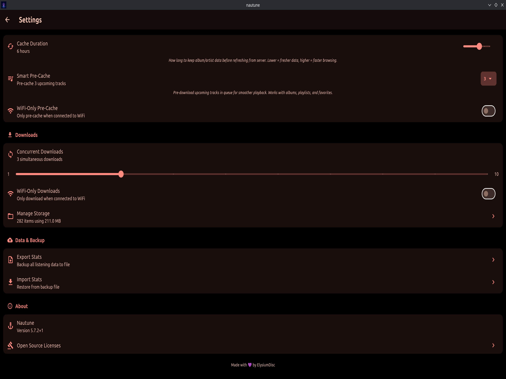
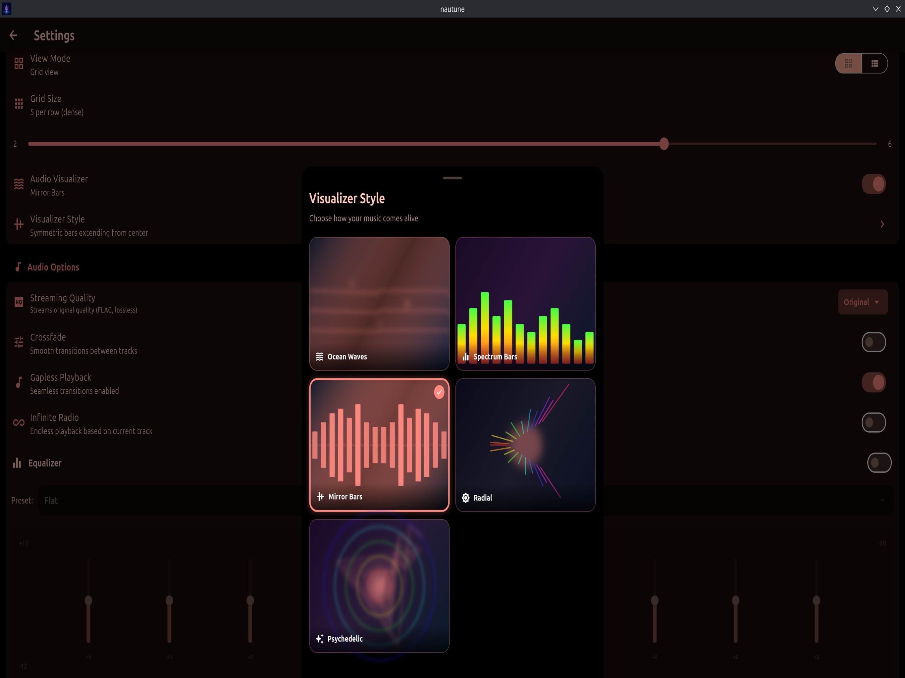
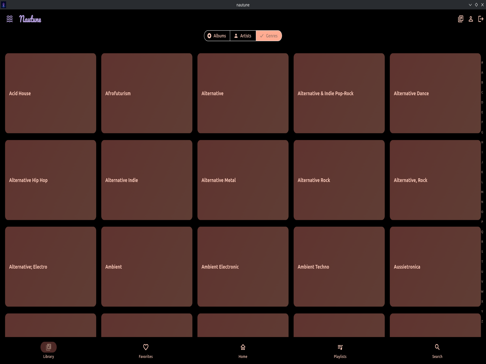
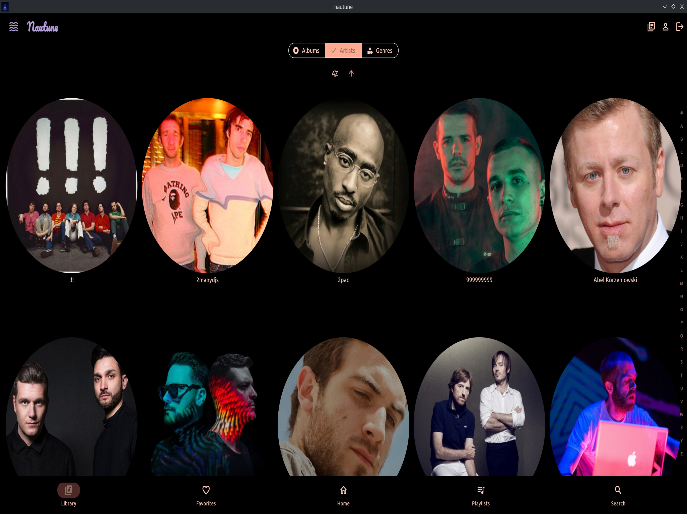
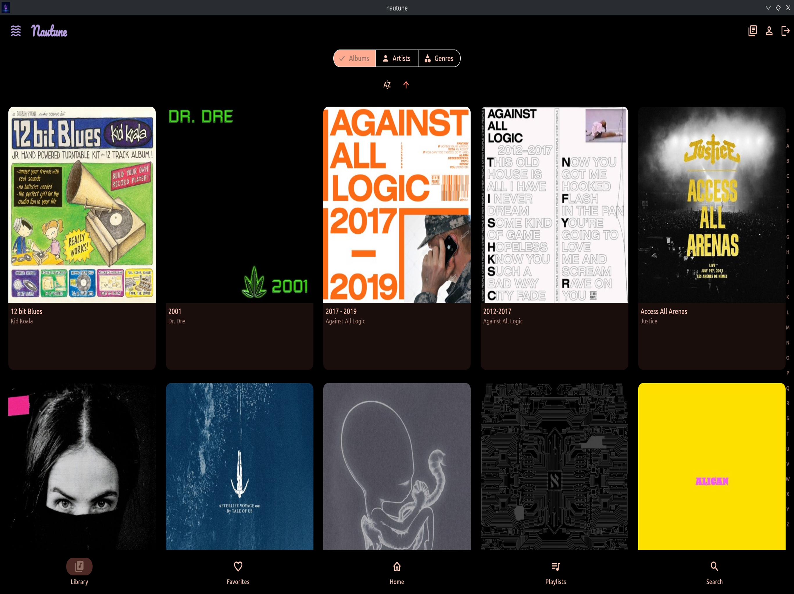
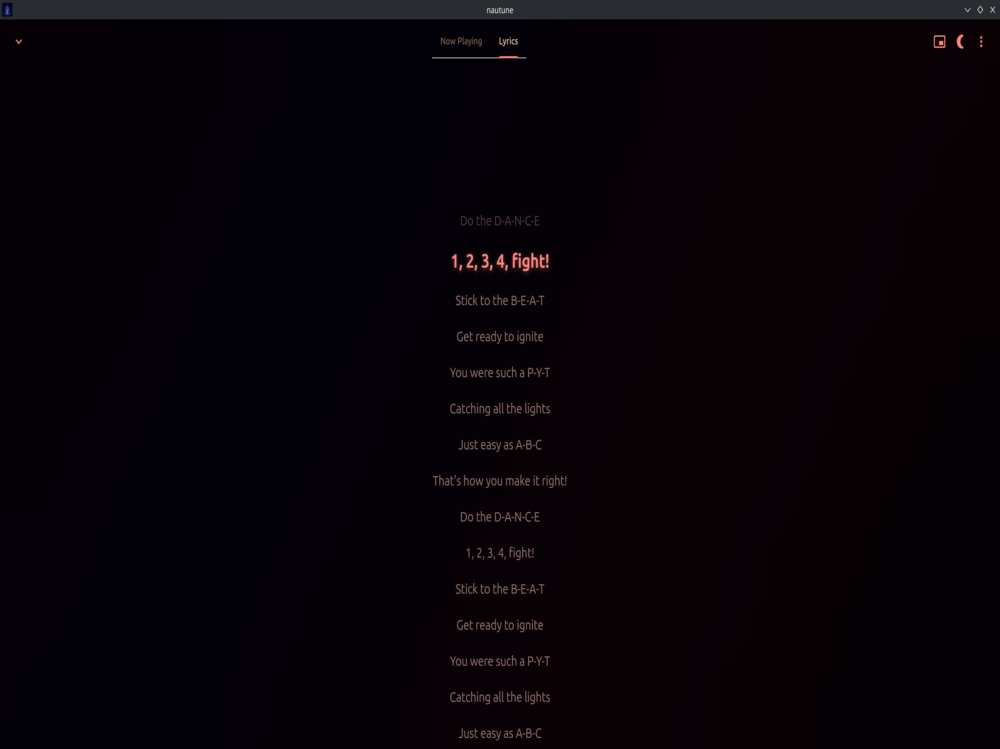
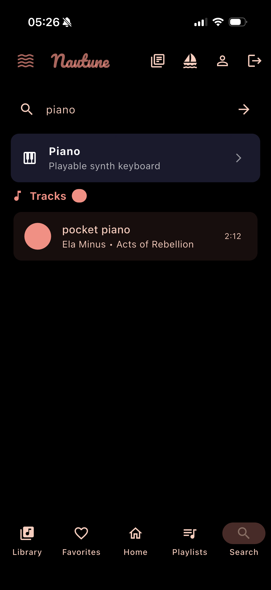
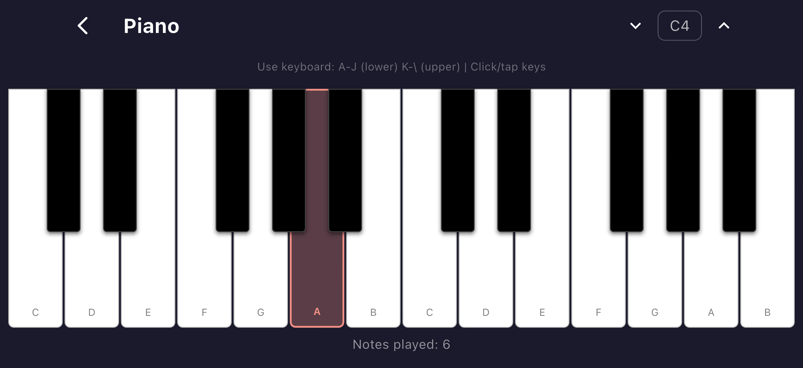

# Nautune 🔱🌊

**Nautune** (Poseidon Music Player) is a high-performance, visually stunning music client for Jellyfin. Built for speed, offline reliability, and an immersive listening experience.

## ✨ Key Features

- **6 Now Playing Layouts**: Classic, Blur, Card, Gradient, Compact, and Full Art - choose your preferred player design
- **Your Rewind**: Spotify Wrapped-style yearly listening reports with shareable exports
- **ListenBrainz Integration**: Scrobble your plays and get personalized music recommendations (matches via MusicBrainz IDs for reliable library matching)
- **Popular Tracks**: Artist pages show top 5 most popular tracks globally with dynamic accent colors, album pages highlight popular songs with flame icons (powered by ListenBrainz)
- **Artist Page Redesign**: Dynamic gradient backgrounds extracted from artist artwork, expandable bio cards, compact album grid layout
- **Fleet Mode**: Real-time synchronized playback across devices - listen together with friends via QR code or share link, with drift correction, queue index tracking, and bounded attribution caching (formerly Collaborative Playlists)
- **Helm Mode**: Remote control any other Nautune instance on the same Jellyfin server — full transport controls (play/pause, skip, volume, progress bar) without needing local playback, powered by persistent WebSocket via the Jellyfin Sessions API with optimistic state updates and session disappearance detection
- **Custom Color Theme**: Create your own theme with primary/secondary color picker
- **Alternate App Icons**: Choose between Classic (purple), Sunset (orange), Crimson (red), and Emerald (green) icons across all platforms
- **10-Band Equalizer** (Linux): Full graphic EQ with 12 presets (Rock, Pop, Jazz, Classical, and more)
- **5 Audio Visualizers**: Ocean Waves, Spectrum Bars, Mirror Bars, Radial, and Psychedelic styles
- **TUI Spectrum Visualizer**: ASCII spectrum analyzer in TUI mode — real-time `▁▂▃▅▇█` bars driven by PulseAudio FFT with peak tracking and gravity decay
- **Real-Time FFT**: True audio-reactive visualization using PulseAudio (Linux) and MTAudioProcessingTap (iOS)
- **MPRIS Integration**: Linux desktop media key support, GNOME/KDE widgets, and KDE Connect — automatic via audio_service
- **Smart Playlists**: Tag-aware mood playlists (Chill, Energetic, Melancholy, Upbeat) using actual file tags
- **Smart Pre-Cache**: Configurable pre-caching of current and upcoming tracks (3, 5, or 10) with WiFi-only option
- **Smart Lyrics**: Multi-source lyrics with sync, caching, and pre-fetching
- **42 Nautical Milestones**: Earn achievements as you listen
- **Track Sharing**: Share downloaded audio files via AirDrop (iOS) or file manager (Linux)
- **Storage Management**: Separate views for downloads, cache, loops, waveforms, and charts with accurate stats
- **Listening Analytics**: Heatmaps, streaks, weekly comparisons, 28-day activity sparkline, and animated stat counters with trend indicators
- **Your Sound DNA**: Concentric arc visualization of your top genres with animated rendering
- **Live Search**: Results appear as you type with 300ms debounce — no Enter key required
- **Track Info Sheet**: Long-press any track to view detailed audio metadata (codec, bitrate, sample rate, bit depth, MusicBrainz IDs)
- **Smart Offline Mode**: Persistent offline preference, auto-detects airplane mode, seamless downloaded content playback, complete network silence (zero background requests)
- **A-B Repeat Loop**: Set loop markers on downloaded/cached tracks to repeat a section (long-press with haptic feedback on iOS, or use the A-B Loop button on desktop). Save loops for later recall.
- **Artist Radio**: Start radio from any artist page — seeds 50 similar tracks with continuous Infinite Radio
- **Recently Played**: Full listening history screen with day-grouped events, tap to play, long-press for context menu
- **Reorderable Nav Tabs**: Long-press the bottom bar to drag-and-drop reorder tabs — persists across restarts
- **Smart Battery Saver**: Automatically disables power-hungry features (visualizers, crossfade, gapless, pre-caching) when offline — snapshot/restore preserves your settings, streaming quality stays untouched
- **Infinite Radio**: Auto-generates similar tracks when your queue runs low — toggle from the full player's more options menu
- **High-Fidelity Playback**: Native backends for Linux and iOS ensuring bit-perfect audio with optimized position tracking, double-buffered visualizer rendering, reactive network quality adaptation, gapless crossfade via player swapping, and shared palette color cache
- **CarPlay Support**: Take your Jellyfin library on the road with CarPlay interface
- **Personalized Home**: Discover, On This Day, and For You recommendation shelves

## 📻 The Network (Easter Egg)

A hidden radio feature [other-people.network](https://www.other-people.network) - Nicolas Jaar's experimental radio project.

### How to Access

1. Go to **Library** tab
2. Search for **"network"**
3. Tap the **"The Network"** card that appears

### Using The Network

- **Channel Dial**: Enter any number between 0-333 to tune to the nearest available channel
- **Channel List**: Browse and tap any of the 60+ available channels
- **Mute**: Toggle audio with the speaker icon in the top bar

### Save for Offline

The Network supports offline listening with auto-caching:

1. Tap the **gear icon** in the top right
2. Enable **"Save for Offline"**
3. Play any channel - it automatically downloads in the background
4. View saved channels in the settings panel with channel numbers and storage size
5. Delete individual channels or clear all from settings

When offline, only your saved channels appear in the list. The app shows an "OFFLINE" indicator when auto-cache is enabled.

### Demo Mode & Offline Access

The Network easter egg works in demo mode and airplane mode:

- **With Downloads**: If you've downloaded channels while online, they remain accessible in demo mode and offline
- **Without Downloads**: Shows a helpful message explaining that channels need to be downloaded while online
- Download all channels using the "Download All" button in Settings to ensure full offline access

### Storage Location

Network downloads are stored separately from your Jellyfin library:
- **Linux**: `~/Documents/nautune/network/audio/`
- **iOS**: `Documents/network/audio/`

### Available Channels

112 channels from the Other People Network catalog:

- the network
- traffic princess
- chance fm
- you don't know what love is
- pomegranates in the sky
- hardcore ambient
- work in progress
- waves and sirens
- feet fm
- i shoot like i talk
- heaven's floor
- we weren't made for these times
- water in heaven
- system of a downey
- the answer is in the question
- the answer starts with the word ideology
- in the face of defeat fm
- present choice
- bible fm
- the rejects am
- the rejects fm
- this house is on fire!
- red bull sponsored revolution
- our god flag fm
- naked bieber fm
- fucking classics
- pop harvey
- labour of love
- vito's room
- radio radio
- tv buddha
- century of the self
- the vacuum has no symmetry
- eternal inflation
- condensed matter systems
- multiverse fm
- the object spoke to me
- hot jungle
- spells of angels
- science needs a clown
- questions the shadow knew
- slaughter fm
- jane said of my idol that art was doing its job, tearing away its dead flesh
- cnn
- billionaire fm
- the tennis underground
- history has a way with words
- the future has no birds
- red flag
- the eternal has an accent
- the revolver on the left
- american dream radio
- young me with young you
- everyone gets into heaven
- un coup de dés jamais n'abolira le hasard
- deep symmetry
- america is perfect
- ad me to you
- mirrors still reflect if they break
- let's change the system
- mashcast
- playing with you
- make america great again
- code fm
- la resistencia de ayer es la resistencia de hoy
- sex radio
- standard model
- super symmetry
- whose world is this?
- our world
- famous heart
- fallacy
- live from gaza
- voices fm
- jump radio
- the whole world is watching
- flood fm
- live from las vegas
- yankee yankee yankee cuidado!!!
- pray fm
- it sounded like the finale of the 4th of july
- a new kind of kool aid
- mini infiniti
- spa theory
- near a burning flame
- resist stance
- niar lirpa
- matta clark demolitions
- you can be young forever
- silence fm
- vtgnike is free!!!
- against all logic
- home
- los colores no existen
- other people radio
- geography of heaven
- everywhere i go
- change your name
- life radio
- elegy for the empyre
- took me out
- the number and the siren
- aesthetic of resistance or resistance of aesthetic
- pomegranates
- regular hypnosis
- what made you made me
- radio 333
- nymphs
- sirens
- sirens (digital)

## 🎧 Essential Mix (Easter Egg)

A hidden feature to play the legendary 2-hour Soulwax/2ManyDJs BBC Essential Mix from May 20, 2017.

### How to Access

1. Go to **Library** tab
2. Search for **"essential"**
3. Tap the **"Essential Mix"** card that appears

### Features

- **2-Hour Mix**: The full Soulwax/2ManyDJs BBC Radio 1 Essential Mix
- **Download for Offline**: Download the 233MB audio file for offline listening
- **Demo Mode Support**: Works in demo mode and airplane mode if downloaded while online
- **Radial Visualizer**: Theme-colored gradient bars radiate around album art with glow effects and bass pulse rings (sonar style)
- **Seekable Waveform**: Waveform doubles as progress bar - tap or drag to seek
- **Profile Badge**: BBC Radio 1 Essential Mix badge with archive.org aesthetic appears in your Profile
- **iOS Low Power Mode**: Visualizer auto-disables when Low Power Mode is enabled to save battery
- **"Essential Discovery" Milestone**: Unlock a badge for discovering this easter egg

### Storage Location

Essential Mix downloads are stored separately from your Jellyfin library:
- **Linux**: `~/Documents/nautune/essential/audio/`
- **iOS**: `Documents/essential/audio/`

### Credit

Audio sourced from [Internet Archive](https://archive.org/details/2017-05-20-soulwax-2manydjs-essential-mix).

## 🎸 Frets on Fire (Easter Egg)

A Guitar Hero-style rhythm game that auto-generates playable charts from any track in your library.

### How to Access

1. Go to **Library** tab
2. Search for **"fire"** or **"frets"**
3. Tap the **"Frets on Fire"** card that appears

### How to Play

1. **Select a track** - Only downloaded tracks are available (the game needs to analyze the audio file)
   - **Duration limits**: iOS max 15 min, Desktop max 30 min (prevents memory crashes)
2. **Wait for analysis** - The app decodes and analyzes the audio using spectral flux onset detection (2-10 seconds depending on track length)
3. **Play the game**:
   - Notes fall from the top in **5 colored lanes** (Green, Red, Yellow, Blue, Orange - like Guitar Hero)
   - Hit notes when they cross the line at the bottom
   - **Mobile**: Tap the lane
   - **Desktop**: Press 1-5 or F1-F5 keys
4. **Scoring** (matches original Frets on Fire):
   - 50 points per note × multiplier
   - Combo builds multiplier: 10→2x, 20→3x, 30→4x (max)
   - Missing a note resets your combo
   - Timing windows adjust based on track BPM

### Features

- **SuperFlux-Inspired Algorithm**: Moving maximum + moving average onset detection (based on academic research)
- **BPM Detection**: Auto-detects tempo and quantizes notes to actual beat grid (16th notes)
- **Pitch Tracking**: Spectral centroid follows the melody - notes move left/right with the song's pitch
- **Hybrid Lane Assignment**: Bass hits use frequency bands, melodic content follows pitch contour
- **Album Art Selection**: Track selection dialog shows album covers for easy browsing
- **Theme-Colored Lanes**: Lane colors derived from your theme (hue shifts around primary color)
- **Real Audio Decoding**: FFmpeg on Linux/desktop, native AVFoundation on iOS
- **Chart Caching**: Generated charts are saved for instant replay
- **Long Track Support**: Handles 3+ hour DJ sets (caps at 3000 notes)
- **Profile Stats**: Total songs, plays, notes hit, and best score displayed in fire-themed card
- **Score Tracking**: High scores and stats saved per track
- **Accuracy Grades**: S/A/B/C/D/F based on hit percentage
- **"Rock Star" Milestone**: Unlock a badge for discovering this easter egg
- **Storage Management**: Manage cached charts in Settings > Data Management

### Visual Feedback

- **FFT Spectrum Visualizer**: Each lane fills up like a spectrum analyzer in real-time
  - Lanes 0-1: Bass frequencies (left side)
  - Lane 2: Mid frequencies (center)
  - Lanes 3-4: Treble frequencies (right side)
  - Full-lane gradient bars pulse with the music, theme-colored
  - Subtle 15-30% opacity ensures note dots remain clearly visible
  - Works on iOS (MTAudioProcessingTap) and Linux (PulseAudio)
- **PERFECT/GOOD Hit Text**: Floating feedback text on note hits (gold for PERFECT, white for GOOD)
- **Lightning Effects**: Animated blue lightning with traveling sparks for Lightning Lane bonus
- **Streak Fire Glow**: Fire effect on hit line when combo reaches 10+
- **Milestone Flashes**: "ON FIRE!", "BLAZING!", "INFERNO!", "LEGENDARY!", "GODLIKE!" celebrations

### Controls

**Desktop:**
| Key | Action |
|-----|--------|
| 1-5 or F1-F5 | Hit lanes 1-5 |
| F | Activate Lightning Lane (cheat) |
| Escape | Pause game |

**Mobile/iOS:**
- Tap lanes to hit notes
- Tap the **⚡ bolt icon** (top-right during gameplay) to activate Lightning Lane cheat

### Bonus Power-Ups

Golden bonus notes spawn randomly during gameplay (~1 per 30-60 seconds). Hit them to collect power-ups!

| Bonus | Duration | Effect |
|-------|----------|--------|
| **Lightning Lane** | 5 sec | Auto-hits ALL notes in one random lane with lightning visual |
| **Shield** | Until used | Protects combo from 1-2 misses (doesn't reset streak) |
| **Double Points** | 5 sec | 2x score multiplier (stacks with combo for up to 8x!) |
| **Multiplier Boost** | Instant | Instantly jump to max 4x multiplier |
| **Note Magnet** | 3 sec | Forgiving timing window - slightly off hits still count |

Active bonuses display in the corner with countdown timers.

### Legendary Unlock: Through the Fire and Flames

**"Through the Fire and Flames" by DragonForce** - the ultimate Guitar Hero challenge is included!

- **Always available** in demo mode and offline mode (bundled in app)
- In online mode: Get a **PERFECT score** (100% accuracy, no misses) on ANY song to unlock it
- Once unlocked online, the legendary status persists forever

### Controls

| Platform | Green | Red | Yellow | Blue | Orange | Pause | Fire Mode |
|----------|-------|-----|--------|------|--------|-------|-----------|
| Mobile   | Tap 1 | Tap 2 | Tap 3 | Tap 4 | Tap 5 | Pause button | N/A |
| Desktop  | 1/F1  | 2/F2  | 3/F3   | 4/F4  | 5/F5   | Escape | F key |

**Fire Mode**: Press 'F' on desktop to instantly activate fire mode (cheat key for testing streak animations).

## 🌧️ Relax Mode (Easter Egg)

An ambient sound mixer for focus or relaxation, inspired by [ebithril/relax-player](https://github.com/ebithril/relax-player).

### How to Access

1. Go to **Library** tab
2. Search for **"relax"**
3. Tap the **"Relax Mode"** card that appears

### Features

- **5 Sound Layers**: Mix rain, thunder, campfire, ocean waves, and loon sounds with vertical sliders
- **Seamless Loops**: Ambient audio loops continuously without gaps
- **Works Everywhere**: Available in demo mode, offline mode, and airplane mode (uses bundled assets)
- **Stats Tracking**: Track total time spent and sound usage breakdown
- **"Calm Waters" Milestone**: Unlock a badge for discovering Relax Mode

## 🎹 Piano (Easter Egg)

A playable synth keyboard inspired by [upiano](https://github.com/eliasdorneles/upiano). Generates audio in-memory using additive synthesis — no asset files or new dependencies.

### How to Access

**GUI:**
1. Go to **Library** tab
2. Search for **"piano"**
3. Tap the **"Piano"** card that appears

**TUI:**
- Press `P` to open the ASCII piano overlay
- Or use the command palette (`Ctrl+K`) and search "Piano"

### Features

- **Programmatic Synthesis**: Additive synthesis (fundamental + 2nd/3rd harmonics) with ADSR envelope, 16-bit PCM WAV at 44.1kHz
- **6-Voice Polyphony**: Round-robin AudioPlayer pool for simultaneous notes
- **Visual Keyboard**: 2-octave piano with touch/click support and accent-color press highlighting
- **Desktop Keyboard Mapping** (upiano-style):
  - Lower octave: `A W S E D F T G Y H U J` → C C# D D# E F F# G G# A A# B
  - Upper octave: `K O L P ; ' ] \` → C C# D D# E F F# G
- **Octave Shifting**: Navigate C2–C6 with octave up/down buttons (GUI) or `,`/`.` keys (TUI)
- **Works Everywhere**: Fully offline — available in online, offline, demo, and airplane modes
- **TUI Overlay**: ASCII piano with box-drawing art, key highlights, and keyboard mapping reference
- **Stats Tracking**: Total notes played and session time displayed in Profile
- **"Virtuoso" Milestone**: Unlock a badge for discovering the Piano

### Storage

Piano generates audio programmatically and writes WAV files to a temporary directory for playback. Temp files are cleaned up when the piano screen is closed.

## 🎶 Healing Frequencies (Easter Egg)

A meditative tone generator inspired by [healing-frequencies](https://github.com/evoluteur/healing-frequencies) by Olivier Giulieri (MIT). All 11 reference categories are included plus a bonus **Schumann** category — so 12 in total.

### How to Access

1. Open the **Library** tab
2. Search for **"solfeggio"**, **"healing"**, **"hz"**, **"frequency"**, or **"frequencies"**
3. Tap the **"Healing Frequencies"** card

Also reachable from Settings → Your Music → Easter Eggs.

### Categories

| # | Category | Count | Notes |
|---|----------|-------|-------|
| 1 | Solfeggio | 11 | UT · RE · MI · FA · SOL · LA · SI · 852 · 963 · 1152 · 2172 |
| 2 | Healing | 4 | 128 · 256 · 512 · 1024 Hz tuning-fork tones |
| 3 | Organs | 15 | Stomach, Pancreas, Gall Bladder, Liver, Kidneys, Adrenals… |
| 4 | Mineral Nutrients | 17 | Sulphur, Selenium, Potassium, Calcium, Magnesium, Iron… |
| 5 | Ohm | 4 | Low · Mid · High · Ultra High |
| 6 | Chakras | 9 | Earth star → Soul star, with Sanskrit names |
| 7 | DNA Nucleotides | 4 | Cytosine · Thymine · Adenine · Guanine |
| 8 | Nikola Tesla 3·6·9 | 3 | 333 · 639 · 999 |
| 9 | Cosmic Octave | 11 | Planetary harmonics (Cousto) |
| 10 | Osteopathic (Otto) | 3 | 32 · 64 · 128 Hz |
| 11 | Angels | 12 | 111…999 + 4096 · 4160 · 4225 |
| 12 | Schumann (bonus) | 1 | 7.83 Hz — inaudible; plays 501 Hz audible octave |

### Features

- **Pure synthesis**: sine-wave oscillators built with integer-cycle WAV loops — head sample equals tail sample, so loops are click-free. No assets, no network, no cache.
- **Works offline**: every frequency plays identically online and offline, including demo mode and airplane mode.
- **Collapsible sections** with brief descriptions sourced directly from the reference project.
- **Schumann (7.83 Hz)** is below the audible range; the app plays its 6-octave audible equivalent (~501 Hz) with a hint in the UI.
- **Volume slider + master stop** in the app bar; tap a pill to play, tap again to stop.
- **iOS/macOS mix-with-others** — tones layer over other playing audio.
- **"Healing Frequencies Discovered"** tracked for the milestone system.

Credit: Inspired by [healing-frequencies](https://github.com/evoluteur/healing-frequencies) by Olivier Giulieri — MIT licensed. All Hz values and labels mirror the reference directory.

### Keyboard Bindings

**Navigation**
| Key | Action |
|-----|--------|
| `j` / `k` | Move selection down/up |
| `h` / `l` | Navigate back/forward (switch panes) |
| `gg` / `Home` | Go to top of list |
| `G` / `End` | Go to bottom of list |
| `PgUp` / `PgDn` | Page up/down |
| `a` / `A` | Jump to next/previous letter group |
| `Tab` | Cycle through sections |
| `Enter` | Play/Select item |
| `Esc` | Exit search / Go back |

**Playback**
| Key | Action |
|-----|--------|
| `Space` | Toggle play/pause |
| `n` / `p` | Next/Previous track |
| `r` / `t` | Seek backward/forward 5 seconds |
| `,` / `.` | Seek backward/forward 60 seconds |
| `S` | Stop playback |
| `R` | Cycle repeat mode |
| `s` | Shuffle queue |

**Volume**
| Key | Action |
|-----|--------|
| `+` / `-` | Volume up/down |
| `m` | Toggle mute |

**Queue**
| Key | Action |
|-----|--------|
| `e` | Add selected track to queue |
| `E` / `c` | Clear queue |
| `x` / `d` | Delete item from queue |
| `J` / `K` | Move queue item down/up |

**A-B Loop** (for downloaded/cached tracks)
| Key | Action |
|-----|--------|
| `[` | Set loop start point (A) |
| `]` | Set loop end point (B) |
| `\` | Clear loop markers |

**Other**
| Key | Action |
|-----|--------|
| `/` | Enter search mode |
| `f` | Toggle favorite on track |
| `v` | Toggle spectrum visualizer |
| `T` | Cycle through themes |
| `P` | Open Piano overlay |
| `Ctrl+K` | Open command palette (fuzzy search all commands) |
| `?` | Show/hide help overlay |
| `X` | Full reset (stop + clear) |
| `q` | Quit |

### Features

- **10 Built-in Themes**: Dark, Gruvbox, Nord, Catppuccin, Dracula, Solarized, and more
- **Persistent Theme**: Theme selection saved and restored between restarts
- **Album Art Colors**: Dynamic primary color extraction with smooth transitions
- **Synchronized Lyrics**: Auto-scrolling lyrics pane with multi-source fallback
- **Window Dragging**: Drag the tab bar to reposition the window
- **Tab Bar**: Top navigation with section tabs and now-playing indicator
- **Sidebar Navigation**: Browse Albums, Artists, Queue, Lyrics, or Search
- **ASCII Spectrum Visualizer**: 32-bar, 2-row real-time spectrum analyzer in the status bar using Unicode block elements (`▁▂▃▅▇█`), with peak tracking, gravity decay, and color gradient from accent to primary — toggle with `v`
- **Command Palette**: Fuzzy-searchable command overlay (Ctrl+K) with 34 commands across 7 categories — type to filter, arrow keys to navigate, Enter to execute
- **MPRIS Support**: System media keys, GNOME/KDE media widgets, and KDE Connect integration work automatically on Linux
- **Help Overlay**: Press `?` to see all keybindings organized by category
- **Vim-Style Movement**: Familiar keybindings with multi-key sequence support
- **Letter Jumping**: `a/A` to jump between letter groups in sorted lists
- **Queue Reordering**: `J/K` to move queue items up/down
- **Seek Controls**: `r/t` for ±5s, `,/.` for ±60s seeking
- **A-B Loop Controls**: `[/]` to set loop markers, `\` to clear (downloaded tracks only)
- **ASCII Progress Bar**: `[=========>          ] 2:34 / 4:12` with loop region indicators
- **Volume Indicator**: `Vol: [████████░░] 80%`
- **Scrollbar**: Visual scrollbar on right edge of lists
- **Buffering Spinner**: Animated indicator during audio buffering
- **Box-Drawing Borders**: Classic TUI aesthetic
- **JetBrains Mono Font**: Crisp monospace rendering
- **Window Resizing**: Drag handle in bottom-right corner for resizing
- **Responsive Layout**: UI adapts gracefully to small window sizes

## 🔊 FFT Visualizer Platform Support

| Platform | FFT Method | Status |
|----------|-----------|--------|
| Linux | PulseAudio `parec` loopback | ✅ Instant |
| iOS (downloaded) | MTAudioProcessingTap + vDSP | ✅ Instant |
| iOS (streaming) | Cache then tap | ✅ After cache |
| iOS (gapless) | Auto-restart on transition | ✅ Seamless |

**iOS FFT Reliability**: FFT shadow players are properly stopped before skip/next operations and correctly restarted during gapless playback transitions, ensuring visualizers stay in sync with the currently playing track.

## 🌊 Waveform Support

| Source | Waveform Extraction | Status |
|--------|---------------------|--------|
| Downloaded tracks | Direct extraction | ✅ Instant |
| Cached tracks | Direct extraction | ✅ Instant |
| Streaming tracks | Cache then extract | ✅ After cache |

Waveforms are extracted for all tracks - downloaded, cached, and streaming - enabling the seekable waveform progress bar across all playback scenarios.

---

## 🎨 Visualizer Styles

Nautune offers 5 audio-reactive visualizer styles. Access the picker via **Settings > Appearance > Visualizer Style**.

| Style | Description |
|-------|-------------|
| **Ocean Waves** | Bioluminescent waves with floating particles, bass-reactive depth |
| **Spectrum Bars** | Classic vertical frequency bars with album art colors, glowing peak indicators |
| **Mirror Bars** | Symmetric bars extending from center, creates "sound wave" look |
| **Radial** | Circular bar arrangement with slow rotation, bass pulse rings, bright center core |
| **Psychedelic** | Milkdrop-inspired effects with 3 auto-cycling presets |

- **30fps rendering**: Battery-optimized frame rate with smooth interpolation
- **Fast attack / slow decay**: Musical smoothing for natural-feeling reactivity
- **Album art colors**: Spectrum visualizers extract primary color from current artwork
- **Bass boost**: All visualizers react dramatically to bass frequencies
- **Low Power Mode**: Visualizers auto-disable on iOS when Low Power Mode is active
- **Visualizer Position**: Choose where the visualizer appears:
  - **Album Art**: Tap album art to toggle between artwork and visualizer (Plexamp-style)
  - **Controls Bar**: Traditional position behind playback controls
- **Volume Bar Toggle**: Hide the volume slider in Now Playing (Settings > Audio Visualizer) - useful for iOS where system volume is independent

---

## 🎵 ListenBrainz Setup Guide

ListenBrainz is a free, open-source music listening tracker. Connect your account to scrobble plays and get personalized music recommendations.

### Step 1: Create a ListenBrainz Account

1. Go to [listenbrainz.org](https://listenbrainz.org)
2. Click **Sign In / Register** in the top right
3. Create a free account (you can use your MusicBrainz account if you have one)

### Step 2: Get Your User Token

1. Log in to [listenbrainz.org](https://listenbrainz.org)
2. Click your username in the top right corner
3. Select **Settings** from the dropdown
4. Or go directly to [listenbrainz.org/settings/](https://listenbrainz.org/settings/)
5. Find the **User Token** section
6. Your token looks like: `1a2b3c4d-5e6f-7g8h-9i0j-k1l2m3n4o5p6`
7. Click **Copy to clipboard**

### Step 3: Connect in Nautune

1. Open Nautune and go to **Settings**
2. Tap **ListenBrainz** under "Your Music"
3. Tap **Connect Account**
4. Enter your ListenBrainz **username**
5. Paste your **User Token**
6. Tap **Connect**

### That's It!

Once connected:
- Tracks automatically scrobble after playing for 50% or 4 minutes
- View your listening history at [listenbrainz.org/user/YOUR_USERNAME](https://listenbrainz.org)
- Recommendations appear based on your listening patterns
- Scrobbles work offline and sync when you're back online

### Troubleshooting

| Issue | Solution |
|-------|----------|
| "Invalid token" error | Re-copy your token from ListenBrainz settings |
| Scrobbles not appearing | Check that scrobbling is enabled in Settings > ListenBrainz |
| Offline scrobbles | They'll sync automatically when you're back online |

---

---

## 🎬 Videos

<video src="https://github.com/user-attachments/assets/" width="800" controls muted></video>

*More videos coming soon showcasing features, easter eggs, and UI effects.*

---

## 📸 Screenshots

### Linux / Desktop

### iOS

### CarPlay

## 🧪 Review / Demo Mode

Apple's Guideline 2.1 requires working reviewer access. Nautune includes an on-device demo that mirrors every feature—library browsing, downloads, playlists, CarPlay, and offline playback—without touching a real Jellyfin server.

1. **Credentials**: leave the server field blank, use username `tester` and password `testing`.
2. The login form detects that combo and seeds a showcase library with open-source media. Switching back to a real server instantly removes demo data (even cached downloads).

## 🗺️ Roadmap

| Feature | Platform | Status |
|---------|----------|--------|
| Android Build | Android | 🔜 Planned |
| Helm Mode (Remote Control) | All | ✅ Complete (v6.7, fixed v6.8, hardened v7.6-7.7) |
| Fleet Mode (SyncPlay) | All | ✅ Complete (v6.7, hardened v7.6-7.7) |
| CarPlay Overhaul | iOS | ✅ Complete (v7.3, hardened v8.0) |
| Flatpak Packaging | Linux | ✅ Complete (v6.7) |
| Additional Visualizers | All | ✅ Complete |

- **Android Build**: Native Android app with full feature parity (visualizers, offline, CarPlay equivalent via Android Auto).

## 🙏 Acknowledgments

### Other People Network
The "Network" easter egg features audio content from [www.other-people.network](https://www.other-people.network), a creative project by **Nicolas Jaar** and the **Other People** label. The original site was programmed by **Cole Brown** with design by Cole Brown and Against All Logic, featuring mixes from Nicolas Jaar, Against All Logic, and Ancient Astronaut.

All credit for the radio content, artwork, and creative vision belongs to the Other People team. Visit [other-people.network/about](https://www.other-people.network/#/about) for the full credits list.

### Essential Mix
The "Essential Mix" easter egg features the Soulwax/2ManyDJs BBC Radio 1 Essential Mix (May 20, 2017) hosted on the [Internet Archive](https://archive.org/details/2017-05-20-soulwax-2manydjs-essential-mix). All credit for the mix belongs to Soulwax, 2ManyDJs, and BBC Radio 1.

---

## 📄 License

This project is licensed under the MIT License - see the [LICENSE](LICENSE) file for details.

**Made with 💜 by ElysiumDisc** | Dive deep into your music 🌊🎵
