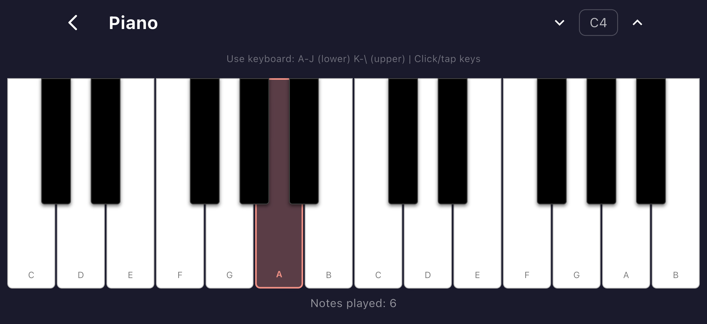

# Nautune 🔱🌊

**Nautune** (the Poseidon Music Player) is a native-feeling iPhone and CarPlay
client for your [Jellyfin](https://jellyfin.org) music library. It streams
from your own server, downloads for offline listening, scrobbles to
ListenBrainz and hides a few surprises beneath the surface. Built with
Flutter, shipped for iOS.

- **Changes:** [CHANGELOG.md](CHANGELOG.md)
- **Building, testing, releasing:** [DEVELOPMENT.md](DEVELOPMENT.md)

## ✨ Features

### Playback
- **Truly gapless playback** and crossfade
- **10-band equalizer** with presets, and **playback speed**
- **Volume levelling** with ReplayGain: Off, Track or Album mode, plus a
  preamp that leaves room to raise quiet tracks
- **Queue** with reordering, shuffle, repeat, **Infinite Radio** (keeps the
  queue topped up with similar tracks) and **Artist Radio**
- **Sleep timer** by time, by number of tracks or at the end of the
  current track, with a gentle fade-out
- **Smart Shuffle** spreads out artists and plays what you heard recently
  later, and the shuffle button restores the original order when turned off
- **Remote control** from the Jellyfin dashboard or your other Jellyfin apps
- **Synced lyrics** from Jellyfin, with LRCLIB and lyrics.ovh as fallbacks
- **A-B repeat loops** on downloaded or cached tracks, saved for later
- **Streaming quality**: Original, 320k, 192k, 128k, or Auto (network-aware),
  with MP3 or AAC for tracks the server has to convert
- **Lock screen and Control Center** controls with artwork; playback
  resumes correctly after calls and other interruptions

### Library
- Albums, artists, genres, playlists and favorites, with server-side sorting
  and A-Z scrubbing
- Live search as you type, with Artists / Albums / Songs filters and a
  Top Result
- Swipe a song right to play it next, or left to add it to the queue, and
  select several songs at once
- A-Z index that jumps straight to any letter, even in huge libraries
- Favorites and playlists sort however you like
- Playlist management (create, rename, add and remove tracks) with changes
  queued while offline and synced later
- Mood playlists (Chill, Energetic, Melancholy, Upbeat) from your own tags
- Personalized Home shelves, Recently Played history and listening stats
- Track info sheet (codec, bitrate, sample rate, MusicBrainz IDs)
- Share downloaded tracks with AirDrop

### Offline
- **Downloads** for albums, playlists, artists or single tracks. Large
  collections, and large downloads over cellular, ask first and show a size
  estimate. Quick downloads grab your Favorites, Top 20 or Recent 20.
- Files that iOS can play are saved as the untouched original. Opus,
  Vorbis, WMA, APE and similar formats are saved as 320 kbps MP3.
- The queue survives the app being killed. It pauses on cellular when
  Wi-Fi-only is on, waits out network drops by itself, and continues an
  interrupted download where it stopped when the server allows it. You can
  set concurrency, a storage limit and age-based cleanup.
- Removing an album or artist keeps songs that a downloaded playlist (or
  another album) still needs.
- Album, artist and playlist pages fall back to your downloads when
  you're offline.
- **Downloads screen** (Library ⋮ → Downloads): browse, search, sort and
  shuffle your offline library, and manage the queue (progress, cancel,
  retry, remove).
- **Offline mode**: Library ⋮ → **Go offline** stops all network traffic,
  downloads included (they resume when you go back online), and shows only
  downloaded music (the Home tab becomes Downloads), even
  across restarts. The app also goes offline by itself when the connection
  or server drops, and it comes back on its own when the server can be
  reached again.
- While offline or in Low Power Mode, battery-hungry extras (visualizers,
  crossfade, gapless, pre-caching) pause. Your settings come back when you
  reconnect.
- Downloads are stored outside iCloud backup. After restoring an iPhone
  from a backup, they show as **File missing** and can be retried.

### CarPlay
- Browse Albums, Artists, Playlists, Albums/Artists A-Z, Recently Played,
  Favorite Tracks and Downloaded Music from one simple root list
- Long lists page through your whole library, the A-Z indexes load each
  letter from the server, and tapping a track opens Now Playing
- Artwork loads from local files for downloaded music, and CarPlay works
  from a cold start while the phone is locked

### ListenBrainz and Last.fm
- Last.fm scrobbling with your own free Last.fm API account (Settings →
  Your Music → Last.fm)
- Scrobbles plays after you've actually listened to half the track or 4
  minutes, whichever comes first (seeking ahead doesn't count), and queues
  them while offline. Last.fm only takes tracks longer than 30 seconds
- Recommendations on Home, plus popular-track highlights on artist and
  album pages

### Look and feel
- An iOS-native design: large titles, frosted glass bars, grouped lists
  and iOS page transitions
- Every theme preset, and your own custom colours, in **light and dark**.
  Follow the palette, follow iOS, or force either one
- Accent colour from your palette or from the artwork that's playing,
  continuous (iOS) or circular corners, and frosted glass or solid bars
- 6 Now Playing layouts: Classic, Blur, Card, Gradient, Compact, Full Art
- 5 audio-reactive visualizers (Ocean Waves, Spectrum Bars, Mirror Bars,
  Radial, Psychedelic), driven by real-time FFT on iOS and switched off
  automatically in Low Power Mode
- Theme presets plus a custom color picker, and alternate app icons
  (Classic, Sunset, Crimson, Emerald)
- Reorderable bottom tabs, and a sidebar on iPad
- VoiceOver labels on the player controls

## 🥚 Easter eggs

Type a keyword as your **whole** search, or open **Settings → About → Easter
Eggs**.

| Name | What it is | Hint |
|------|------------|------|
| 📻 The Network | The 0–333 dial of Nicolas Jaar's Other People radio, with offline saving. Channels lost upstream show "Signal lost" | `network` |
| 🎧 Essential Mix | A legendary two-hour BBC Radio 1 Essential Mix, downloadable | `essential` |
| 🎸 Frets on Fire | A rhythm game that charts your downloaded tracks. Play perfectly for a legendary unlock | `frets` |
| 🌧️ Relax Mode | Mix rain, thunder, campfire, waves and loons | `relax` |
| 🎹 Piano | A playable two-octave synth keyboard | `piano` |
| 🎶 Healing Frequencies | Solfeggio, chakra and other reference tones, synthesized on device | `solfeggio` |

## 📋 Requirements

- **iPhone or iPad on iOS 15 or later.** CarPlay needs a CarPlay-capable car
  or head unit.
- **Jellyfin 10.9 or newer.** The client is written against the Jellyfin
  12.1 API and uses only modern authentication, so it keeps working with
  legacy authorization turned off.
- `http://` and local-network (LAN) servers are supported. iOS asks for
  Local Network permission the first time you connect.
- Reverse-proxy sub-paths work, for example `https://example.com/jellyfin`.

## 🎵 ListenBrainz setup

1. Create a free account at [listenbrainz.org](https://listenbrainz.org).
   A MusicBrainz account works.
2. Copy your **User Token** from
   [listenbrainz.org/settings](https://listenbrainz.org/settings/).
3. In Nautune open **Settings → ListenBrainz → Connect Account**, enter
   your username and paste the token.

Plays then scrobble automatically, and recommendations appear on Home.
If you get "Invalid token", copy the token again. If scrobbles don't show
up, check that **Enable Scrobbling** is on. Offline scrobbles sync by
themselves when you're back online, or you can tap **Retry Now**.

## 🧪 Demo / App Review mode

You can try Nautune without a Jellyfin server. This is also the access
path for App Review (Guideline 2.1).

1. On the login screen, leave **Server URL** blank.
2. Sign in as `tester` with password `testing`, or tap **Fill credentials**
   under "Need a guided demo?".

This loads an on-device showcase library built from bundled royalty-free
tracks (see [assets/demo/README.md](assets/demo/README.md)). You can
browse, build playlists, favorite tracks, play downloads offline and use
CarPlay. Signing in to a real server removes all demo data.

## 📸 Screenshots

### iPhone

### CarPlay

## 🙏 Acknowledgments

### Other People Network
The "Network" easter egg features audio content from
[www.other-people.network](https://www.other-people.network), a creative
project by **Nicolas Jaar** and the **Other People** label. The original
site was programmed by **Cole Brown** with design by Cole Brown and Against
All Logic, featuring mixes from Nicolas Jaar, Against All Logic, and Ancient
Astronaut.

All credit for the radio content, artwork, and creative vision belongs to
the Other People team. Visit
[other-people.network/about](https://www.other-people.network/#/about) for
the full credits list.

### Essential Mix
The "Essential Mix" easter egg features the Soulwax/2ManyDJs BBC Radio 1
Essential Mix (May 20, 2017) hosted on the
[Internet Archive](https://archive.org/details/2017-05-20-soulwax-2manydjs-essential-mix).
All credit for the mix belongs to Soulwax, 2ManyDJs, and BBC Radio 1.

### Inspirations
- Relax Mode: [ebithril/relax-player](https://github.com/ebithril/relax-player)
- Piano: [eliasdorneles/upiano](https://github.com/eliasdorneles/upiano)
- Healing Frequencies:
  [evoluteur/healing-frequencies](https://github.com/evoluteur/healing-frequencies)
  by Olivier Giulieri (MIT). The frequency values and labels mirror that
  project.
- Frets on Fire: named after, and scored like, the original open-source
  Frets on Fire game

## 📄 License

MIT. See [LICENSE](LICENSE).

**Made with 💜 by ElysiumDisc** | Dive deep into your music 🌊
